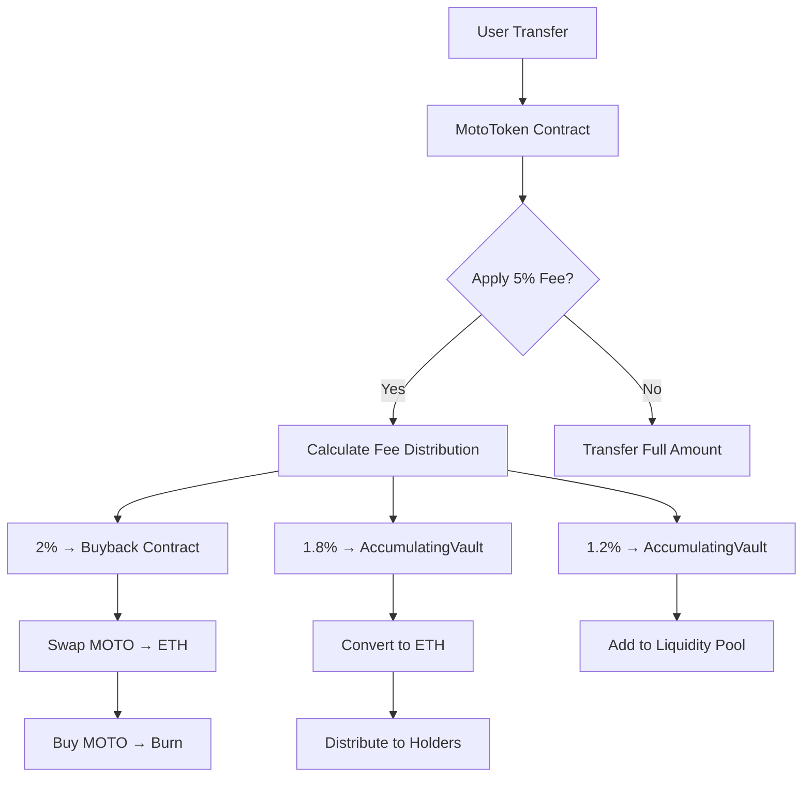

# 🏍️ Moto Token ($MOTO) - The Self-Sustaining Growth Engine

<div style="text-align: center;">
  
  <h1>Moto Token ($MOTO)</h1>
  <p><em>The Self-Sustaining Growth Engine on Base</em></p>
</div>

<div style="text-align: center;">


</div>

> **Moto Token ($MOTO)** is a next-generation hyper-deflationary ERC-20 token built on Coinbase's Base blockchain. It features an innovative three-pillar fee mechanism that automatically rewards holders with ETH reflections, funds strategic buybacks to reduce supply, and ensures perpetual liquidity provision. This creates a virtuous cycle of growth, value appreciation, and ecosystem sustainability.

---

## ✨ Key Features

### 🔄 Three-Pillar Economy
- **🏆 ETH Reflections (1.8%)**: Automatic ETH rewards to all holders proportional to their balance
- **🔥 Buyback & Burn (2%)**: Continuous supply deflation through automated market purchases
- **💧 Auto-Liquidity (1.2%)**: Perpetual liquidity provision to maintain healthy trading

### 🛡️ Security & Reliability
- **🔒 OpenZeppelin Standards**: Industry-leading security libraries and practices
- **🛡️ Reentrancy Protection**: Comprehensive guards against reentrancy attacks
- **🚨 Emergency Functions**: Owner-controlled recovery mechanisms for stuck assets
- **⚡ Gas Optimization**: Efficient contract operations for cost-effective transactions

### ⚙️ Advanced Functionality
- **🔧 Modular Architecture**: Separate contracts for specialized functions
- **📊 Real-time Analytics**: On-chain tracking of all economic activities
- **🎛️ Owner Controls**: Configurable parameters with multi-signature security
- **🔄 Automatic Operations**: Self-executing mechanisms requiring no manual intervention

### 🌐 Base Ecosystem Integration
- **⚡ Base Network**: Coinbase's Layer 2 for fast, low-cost transactions
- **🏛️ BaseSwap DEX**: Native DEX integration for seamless token swaps
- **🔍 BaseScan**: Full contract verification and transaction transparency
- **🌉 Ethereum Compatibility**: Full EVM support with existing tools and wallets

---

## 📊 Tokenomics Overview

### Supply Metrics
| Parameter | Value | Notes |
|-----------|-------|--------|
| **Symbol** | $MOTO | Moto Token |
| **Total Supply** | 1,000,000,000 | 1 Billion tokens |
| **Circulating Supply** | 600,000,000 | After 40% initial burn |
| **Decimals** | 18 | Standard ERC-20 |
| **Network** | Base | Coinbase Layer 2 |
| **Contract Type** | ERC-20 | With custom fee logic |

### Fee Structure (5% Total)
| Allocation | Percentage | Purpose | Mechanism |
|------------|------------|---------|-----------|
| **Buyback & Burn** | **2%** | Supply Deflation | Automated market purchases |
| **ETH Reflections** | **1.8%** | Holder Rewards | Proportional ETH distribution |
| **Liquidity Provision** | **1.2%** | Pool Stability | Auto-liquidity addition |
| **Total** | **5%** | **Self-Sustaining** | **No external funding needed** |

### Initial Distribution
| Allocation | Percentage | Amount | Purpose |
|------------|------------|--------|---------|
| Public Sale | 30% | 300M | Community distribution |
| Liquidity Pool | 20% | 200M | Initial DEX liquidity |
| Treasury | 10% | 100M | Development & operations |
| Team | 5% | 50M | Core development (vested) |
| **Initial Burn** | **40%** | **400M** | **Immediate deflation** |
| **Total** | **100%** | **1B** | **Complete allocation** |

### Economic Projections
- **Daily Volume Target**: $100K+ for sustainable operations
- **Monthly Burn Rate**: 1-2% of circulating supply
- **Annual Deflation**: 15-25% through buybacks
- **Holder Rewards**: 0.5-1% monthly ETH distributions

---

## 🏗️ Smart Contract Architecture

### Transaction Flow Diagram



### Core Contracts Overview

#### 🎯 MotoToken.sol - Main Contract
**Purpose**: Primary ERC-20 token contract with fee logic
**Key Functions**:
- `transfer()` - Fee-applied token transfers
- `setContracts()` - Link auxiliary contracts
- `updateFeeRates()` - Modify fee structure
- `calculateFee()` - Preview fee calculations
- `emergencyRecoverToken()` - Stuck asset recovery

**Security Features**:
- ReentrancyGuard protection
- Owner-only critical functions
- Input validation on all parameters
- Fee exemptions for contracts

#### 🛒 Buyback.sol - Deflation Engine
**Purpose**: Automated token buyback and burning mechanism
**Key Functions**:
- `executeBuyback()` - Trigger buyback process
- `updateMinTokensForBuyback()` - Set execution threshold
- `updateMaxSlippage()` - Configure slippage tolerance
- `canExecuteBuyback()` - Check execution conditions

**Integration**:
- BaseSwap router for token swaps
- Dead address burning (0x...dead)
- Minimum threshold requirements
- Gas-optimized execution

#### 🏦 AccumulatingVault.sol - Rewards & Liquidity
**Purpose**: ETH reflection rewards and automatic liquidity provision
**Key Functions**:
- `processTokens()` - Convert and distribute fees
- `distributeRewards()` - Batch reward distribution
- `claimRewards()` - Individual reward claiming
- `updatePercentages()` - Modify distribution ratios

**Features**:
- Proportional reward distribution
- Claim cooldown mechanism
- Liquidity pool management
- Emergency ETH recovery

#### 🔒 LiquidityLocker.sol - LP Protection
**Purpose**: Time-locked liquidity tokens for investor confidence
**Key Functions**:
- `lockLiquidity()` - Lock LP tokens for specified period
- `extendLock()` - Extend existing lock duration
- `unlockLiquidity()` - Release tokens after lock period
- `getLockInfo()` - View lock details

**Security**:
- Time-lock enforcement
- Owner-controlled extensions
- Transparent lock tracking
- Emergency unlock capabilities

### Contract Dependencies

```
MotoToken
├── Ownable (OpenZeppelin)
├── ERC20 (OpenZeppelin)
├── ReentrancyGuard (OpenZeppelin)
└── IUniswapV2Router02 (Interface)

Buyback
├── Ownable
├── ReentrancyGuard
├── IERC20
└── IUniswapV2Router02

AccumulatingVault
├── Ownable
├── ReentrancyGuard
├── IERC20
└── IUniswapV2Router02

LiquidityLocker
└── Ownable
```

### Deployment Order
1. **Deploy BaseSwap Router Interface** (if needed)
2. **Deploy LiquidityLocker**
3. **Deploy Buyback Contract**
4. **Deploy AccumulatingVault**
5. **Deploy MotoToken**
6. **Configure Contract Links**
7. **Set Fee Exemptions**
8. **Initial Token Distribution**

---

## 🚀 Quick Start Guide

### 📋 Prerequisites Checklist

- [x] **Node.js 18+** - Runtime environment
- [x] **npm or yarn** - Package manager
- [x] **MetaMask** - Web3 wallet configured for Base
- [x] **Base Network** - Added to wallet (Chain ID: 8453)
- [x] **Test ETH** - For Base Sepolia testnet deployment
- [x] **Git** - Version control system

### 📦 Installation & Setup

```bash
# 1. Clone the repository
git clone https://github.com/mototoken/moto-token.git
cd moto-token

# 2. Install dependencies
npm install

# 3. Set up environment variables
cp .env.example .env

# 4. Configure your .env file
echo "PRIVATE_KEY=your_private_key_here" >> .env
echo "BASESCAN_API_KEY=your_basescan_api_key" >> .env
echo "OWNER_ADDRESS=your_wallet_address" >> .env
```

### 🛠️ Development Workflow

#### Local Development
```bash
# Compile smart contracts
npx hardhat compile

# Run test suite
npx hardhat test

# Run specific test file
npx hardhat test test/MotoToken.test.js

# Generate test coverage
npx hardhat coverage
```

#### Testnet Deployment
```bash
# Deploy to Base Sepolia testnet
npx hardhat run scripts/deploy.js --network basesepolia

# Verify contracts on BaseScan
npx hardhat verify --network basesepolia DEPLOYED_CONTRACT_ADDRESS

# Run integration tests on testnet
npx hardhat run scripts/test-integration.js --network basesepolia
```

#### Mainnet Deployment
```bash
# Deploy to Base mainnet (use with caution)
npx hardhat run scripts/deploy.js --network base

# Verify on BaseScan mainnet
npx hardhat verify --network base DEPLOYED_CONTRACT_ADDRESS
```

### 🔧 Configuration Files

#### Hardhat Configuration (`hardhat.config.js`)
```javascript
require("@nomicfoundation/hardhat-toolbox");

module.exports = {
  solidity: {
    version: "0.8.27",
    settings: {
      optimizer: {
        enabled: true,
        runs: 200
      }
    }
  },
  networks: {
    hardhat: { ... },
    basesepolia: {
      url: "https://sepolia.base.org",
      accounts: [process.env.PRIVATE_KEY],
      gasPrice: 1000000000
    },
    base: {
      url: "https://mainnet.base.org",
      accounts: [process.env.PRIVATE_KEY],
      gasPrice: 1000000000
    }
  },
  etherscan: {
    apiKey: {
      base: process.env.BASESCAN_API_KEY
    }
  }
};
```

#### Environment Variables (`.env`)
```env
# Deployment
PRIVATE_KEY=your_private_key_without_0x_prefix
OWNER_ADDRESS=0xYourWalletAddress

# Verification
BASESCAN_API_KEY=your_basescan_api_key

# Optional
INFURA_KEY=your_infura_key
COINMARKETCAP_API_KEY=your_cmc_api_key
```

---

## 📋 Usage Examples

### 💻 CLI Commands

#### Deployment Commands
```bash
# Full deployment suite
npx hardhat run scripts/deploy.js --network basesepolia

# Individual contract deployment
npx hardhat run scripts/deploy-mototoken.js --network basesepolia
npx hardhat run scripts/deploy-buyback.js --network basesepolia
npx hardhat run scripts/deploy-vault.js --network basesepolia

# Contract verification
npx hardhat verify --network basesepolia CONTRACT_ADDRESS "ConstructorArgs"
```

#### Testing Commands
```bash
# Run all tests
npx hardhat test

# Run with gas reporting
REPORT_GAS=true npx hardhat test

# Run specific test suite
npx hardhat test test/Buyback.test.js

# Run tests with coverage
npx hardhat coverage
```

### 🔗 Smart Contract Interaction

#### Basic Token Operations
```javascript
// Initialize contracts
const motoToken = await ethers.getContractAt("MotoToken", MOTO_ADDRESS);
const buyback = await ethers.getContractAt("Buyback", BUYBACK_ADDRESS);
const vault = await ethers.getContractAt("AccumulatingVault", VAULT_ADDRESS);

// Transfer tokens (5% fee applied automatically)
const transferTx = await motoToken.transfer(recipientAddress, ethers.parseEther("100"));
await transferTx.wait();

// Check balance
const balance = await motoToken.balanceOf(userAddress);
console.log("Balance:", ethers.formatEther(balance));
```

#### Fee Management
```javascript
// Calculate fee for a transfer
const amount = ethers.parseEther("1000");
const [feeAmount, netAmount] = await motoToken.calculateFee(amount);
console.log("Fee:", ethers.formatEther(feeAmount));
console.log("Net Amount:", ethers.formatEther(netAmount));

// Update fee rates (owner only)
await motoToken.updateFeeRates(3, 2); // 3% buyback, 2% liquidity
```

#### Reward System
```javascript
// Check claimable rewards
const [rewardAmount, nextClaimTime] = await vault.getUserRewardInfo(userAddress);
console.log("Claimable:", ethers.formatEther(rewardAmount));

// Claim rewards
const claimTx = await vault.claimRewards();
await claimTx.wait();

// Check reward distribution info
const totalRewards = await vault.totalRewardsDistributed();
const totalETH = await vault.totalETHForRewards();
```

#### Buyback Operations
```javascript
// Check if buyback can be executed
const [canExecute, tokenBalance] = await buyback.canExecuteBuyback();
console.log("Can Execute:", canExecute);

// Execute buyback (anyone can call)
if (canExecute) {
  const buybackTx = await buyback.executeBuyback();
  await buybackTx.wait();
}
```

### 🌐 Web3 Integration

#### MetaMask Connection
```javascript
// Connect to MetaMask
await window.ethereum.request({ method: 'eth_requestAccounts' });

// Switch to Base network
await window.ethereum.request({
  method: 'wallet_switchEthereumChain',
  params: [{ chainId: '0x2105' }], // Base mainnet
});

// Add Base network if not present
await window.ethereum.request({
  method: 'wallet_addEthereumChain',
  params: [{
    chainId: '0x2105',
    chainName: 'Base',
    nativeCurrency: { name: 'ETH', symbol: 'ETH', decimals: 18 },
    rpcUrls: ['https://mainnet.base.org'],
    blockExplorerUrls: ['https://basescan.org']
  }]
});
```

#### Contract Interaction with Ethers.js
```javascript
import { ethers } from 'ethers';

// Connect to provider
const provider = new ethers.BrowserProvider(window.ethereum);
const signer = await provider.getSigner();

// Contract instances
const motoToken = new ethers.Contract(MOTO_ADDRESS, MOTO_ABI, signer);
const vault = new ethers.Contract(VAULT_ADDRESS, VAULT_ABI, signer);

// Read operations
const balance = await motoToken.balanceOf(await signer.getAddress());
const feeRate = await motoToken.getTotalFeeRate();

// Write operations
const transferTx = await motoToken.transfer(recipient, amount);
await transferTx.wait();
```

---

## 🔧 Advanced Configuration

### Environment Variables Reference

```env
# ========== REQUIRED ==========
PRIVATE_KEY=your_private_key_without_0x_prefix
OWNER_ADDRESS=0xYourMultiSigOrWalletAddress
BASESCAN_API_KEY=your_basescan_api_key_for_verification

# ========== OPTIONAL ==========
# RPC Configuration
INFURA_KEY=your_infura_project_key
ALCHEMY_KEY=your_alchemy_api_key

# API Keys for extended functionality
COINMARKETCAP_API_KEY=your_cmc_api_key
ETHERSCAN_API_KEY=your_etherscan_api_key

# Deployment Configuration
INITIAL_LIQUIDITY_ETH=1.0
INITIAL_LIQUIDITY_TOKENS_PERCENT=80
DEPLOYMENT_GAS_LIMIT=8000000

# Testing Configuration
TEST_ACCOUNTS_COUNT=10
TEST_ETH_AMOUNT=1000
```

### Network Configuration Matrix

| Network | Chain ID | RPC URL | Block Explorer | Status |
|---------|----------|---------|----------------|--------|
| **Base Mainnet** | 8453 (0x2105) | https://mainnet.base.org | https://basescan.org | 🟢 Production |
| **Base Sepolia** | 84532 (0x14a34) | https://sepolia.base.org | https://sepolia.basescan.org | 🟡 Testing |
| **Local Hardhat** | 31337 | http://127.0.0.1:8545 | N/A | 🔵 Development |
| **Local Ganache** | 1337 | http://127.0.0.1:7545 | N/A | 🔵 Development |

### Hardhat Network Configuration

```javascript
// hardhat.config.js
module.exports = {
  networks: {
    // Local development
    hardhat: {
      chainId: 31337,
      gas: 8000000,
      accounts: {
        mnemonic: "test test test test test test test test test test test junk"
      }
    },

    // Base Sepolia testnet
    basesepolia: {
      url: "https://sepolia.base.org",
      accounts: [process.env.PRIVATE_KEY],
      chainId: 84532,
      gasPrice: 1000000000, // 1 gwei
      gas: 8000000
    },

    // Base mainnet
    base: {
      url: "https://mainnet.base.org",
      accounts: [process.env.PRIVATE_KEY],
      chainId: 8453,
      gasPrice: 1000000000,
      gas: 8000000
    }
  }
};
```

### Contract Addresses (Mainnet)

```javascript
// Mainnet Contract Addresses (after deployment)
const CONTRACTS = {
  MOTO_TOKEN: "0x...",
  BUYBACK: "0x...",
  ACCUMULATING_VAULT: "0x...",
  LIQUIDITY_LOCKER: "0x...",
  BASE_SWAP_ROUTER: "0x327Df1E6de05895d2ab08513aaDD9313Fe505d86"
};
```

---

## 🛡️ Security & Risk Management

### Security Best Practices

#### 🔐 Private Key Management
- **Never commit private keys** to version control
- Use **hardware wallets** for mainnet deployments
- Implement **multi-signature** for critical operations
- Regular **key rotation** and backup procedures

#### 🛡️ Smart Contract Security
- **OpenZeppelin Standards**: Industry-leading security libraries
- **Reentrancy Protection**: Comprehensive guards against attacks
- **Input Validation**: All parameters validated before processing
- **Access Control**: Owner-only functions for critical operations

#### 🚨 Emergency Functions
- **Stuck Asset Recovery**: Owner can recover tokens/ETH
- **Circuit Breakers**: Pause functionality for critical issues
- **Timelocks**: Delayed execution for parameter changes
- **Multi-sig Requirements**: Enhanced security for governance

### Security Audit Status

> ⚠️ **Pre-Launch Security Review**: Contracts have undergone internal security review but have not been audited by a professional firm.

#### Planned Security Measures
- **Professional Audit**: Scheduled for Q1 2025 with OpenZeppelin/Certik
- **Bug Bounty Program**: Post-launch vulnerability reporting
- **Ongoing Monitoring**: Real-time contract activity surveillance
- **Regular Updates**: Security patches and improvements

### Risk Assessment

#### 🔴 Critical Risks
- **Smart Contract Vulnerabilities**: Potential exploits in contract logic
- **Owner Key Compromise**: Loss of administrative control
- **DEX Integration Issues**: BaseSwap contract changes or failures

#### 🟡 Medium Risks
- **Impermanent Loss**: Liquidity provision risks
- **Market Volatility**: Price manipulation and flash crashes
- **Network Congestion**: Base network performance issues

#### 🟢 Low Risks
- **Token Distribution**: Fair launch minimizes centralization
- **Community Governance**: Decentralized decision-making
- **Transparent Operations**: On-chain visibility of all activities

### Incident Response Plan

#### 1. Detection Phase
- Automated monitoring alerts
- Community reports
- Security researcher notifications

#### 2. Assessment Phase
- Internal security team evaluation
- External expert consultation
- Impact and scope analysis

#### 3. Containment Phase
- Contract pause if necessary
- Asset protection measures
- Communication with stakeholders

#### 4. Recovery Phase
- Fix deployment and testing
- Gradual system restoration
- Post-mortem analysis

#### 5. Prevention Phase
- Security improvements implementation
- Process and code updates
- Enhanced monitoring systems

### Insurance Coverage
- **Smart Contract Insurance**: Coverage for contract vulnerabilities
- **Liquidity Insurance**: Protection against impermanent loss
- **Operational Insurance**: Business continuity coverage

---

## 📊 Analytics & Monitoring

### On-Chain Metrics
- **Transaction Volume**: Daily/weekly transfer activity
- **Fee Collection**: Automatic fee accumulation tracking
- **Burn Rate**: Token supply reduction monitoring
- **Reward Distribution**: ETH reflection payout tracking

### Key Performance Indicators
- **Total Value Locked (TVL)**: Liquidity pool depth
- **Market Capitalization**: Token valuation tracking
- **Trading Volume**: DEX activity measurement
- **Holder Distribution**: Token ownership analysis

### Monitoring Tools
- **BaseScan**: Contract activity and transaction monitoring
- **The Graph**: Subgraph for advanced querying
- **Dune Analytics**: Community dashboard creation
- **Custom Scripts**: Automated alert systems

---

## 🤝 Contributing

### How to Contribute

We welcome contributions from the community! Here's how you can get involved:

#### 🐛 Bug Reports
1. Check existing issues on GitHub
2. Use the bug report template
3. Provide detailed reproduction steps
4. Include contract addresses and transaction hashes

#### 💡 Feature Requests
1. Check for existing similar requests
2. Use the feature request template
3. Provide detailed use case description
4. Include mockups or technical specifications

#### 🛠️ Code Contributions
1. Fork the repository
2. Create a feature branch (`git checkout -b feature/amazing-feature`)
3. Make your changes following our guidelines
4. Add comprehensive tests
5. Submit a pull request

### Development Guidelines

#### Code Standards
- **Solidity Style Guide**: Follow official Solidity conventions
- **OpenZeppelin Standards**: Use established security patterns
- **Comprehensive Testing**: 100% test coverage requirement
- **Gas Optimization**: Efficient contract operations

#### Testing Requirements
- **Unit Tests**: Individual function testing
- **Integration Tests**: Cross-contract interaction testing
- **Edge Case Testing**: Boundary condition validation
- **Gas Usage Testing**: Performance optimization

#### Documentation Standards
- **Code Comments**: Clear function and variable documentation
- **README Updates**: Feature documentation requirements
- **API Documentation**: Contract interface documentation
- **User Guides**: End-user instruction updates

---

## 📚 Documentation

### 📖 Official Documentation
- **[🏗️ Architecture Overview](./docs/MOTO_TOKEN_ARCHITECTURE_DESIGN.md)** - Technical implementation details
- **[🚀 Deployment Guide](./docs/BASE_MAINNET_DEPLOYMENT_GUIDE.md)** - Step-by-step deployment instructions
- **[💧 Liquidity Guide](./docs/MOTO_LIQUIDITY_PROVISION_GUIDE.md)** - LP provision instructions
- **[📊 Tokenomics](./docs/MOTO_TOKENOMICS_AND_FEES.md)** - Economic model documentation
- **[🔐 Security Audit](./docs/MOTO_SECURITY_AUDIT_RECOMMENDATIONS.md)** - Security assessment guidelines
- **[📋 Compliance](./docs/MOTO_TOKEN_COINBASE_COMPLIANCE_CHECKLIST.md)** - Regulatory compliance checklist

### 🛠️ Developer Resources
- **[BaseSwap Documentation](https://docs.baseswap.org/)** - DEX integration guides
- **[Base Network Docs](https://docs.base.org/)** - Network specifications
- **[OpenZeppelin Docs](https://docs.openzeppelin.com/)** - Security library references
- **[Solidity Docs](https://docs.soliditylang.org/)** - Language specifications

---

## 🌐 Community & Ecosystem

### Official Channels
- **🌐 Website**: [mototoken.xyz](https://mototoken.xyz)
- **🐦 Twitter**: [@MotoToken](https://twitter.com/MotoToken)
- **💬 Discord**: [discord.gg/mototoken](https://discord.gg/mototoken)
- **📧 Email**: contact@mototoken.xyz

### Community Resources
- **📖 Medium**: Technical articles and updates
- **🎥 YouTube**: Educational content and AMAs
- **📱 Telegram**: Community discussions
- **🔗 GitHub**: Open-source development

### Ecosystem Partners
- **🏛️ BaseSwap**: Primary DEX integration
- **🔍 BaseScan**: Contract verification and monitoring
- **📊 Dune Analytics**: Community dashboards
- **🛡️ OpenZeppelin**: Security library provider

---

## 📈 Roadmap & Future Development

### 🚀 Phase 1: Core Launch (Current)
- ✅ Smart contract development
- ✅ Testnet deployment and testing
- ✅ Documentation completion
- 🔄 Mainnet deployment preparation

### 🚀 Phase 2: Ecosystem Expansion (Q1 2025)
- 🔄 Additional DEX integrations
- 🔄 Cross-chain bridge development
- 🔄 Governance token implementation
- 🔄 Staking rewards system

### 🚀 Phase 3: Advanced Features (Q2 2025)
- 🔄 NFT integration
- 🔄 DAO governance
- 🔄 Multi-token rewards
- 🔄 Advanced analytics dashboard

### 🚀 Phase 4: Global Expansion (Q3 2025)
- 🔄 International marketing
- 🔄 Exchange listings
- 🔄 Institutional partnerships
- 🔄 Regulatory compliance expansion

---

## 📄 License & Legal

### License
This project is licensed under the **MIT License** - see the [LICENSE](LICENSE) file for details.

### Legal Notices
- **Not Financial Advice**: This is not financial or investment advice
- **No Warranties**: Software provided "as is" without warranties
- **User Responsibility**: Users are responsible for their own actions
- **Compliance**: Users must comply with local laws and regulations

### Disclaimer
```
This software is provided "as is" without warranty of any kind. Use at your own risk.
The developers are not responsible for any financial losses incurred through the use of this software.
Always do your own research and consult with financial advisors before making investment decisions.
```

---

## 🙏 Acknowledgments

### Core Team
- **Development Team**: Smart contract developers and auditors
- **Design Team**: UI/UX and branding specialists
- **Community Managers**: Community engagement and support

### Technology Partners
- **OpenZeppelin**: Security library providers
- **Base**: Network infrastructure
- **BaseSwap**: DEX integration
- **Hardhat**: Development framework

### Community Contributors
- **Beta Testers**: Testnet participants and feedback providers
- **Security Researchers**: Vulnerability discovery and reporting
- **Content Creators**: Educational content and documentation
- **Community Moderators**: Support and engagement

---

<div style="text-align: center;">
  <p><strong>🚀 Join the Moto Token Revolution</strong></p>
  <p>Building the future of decentralized tokenomics on Base</p>
  <p>
    <a href="https://matmotofix.pro">Website</a> •
    <a href="https://twitter.com/@MatMotoFix_Pro">Twitter</a> •
    <a href="https://discord.gg/MatMotoFix_Pro">Discord</a> •
    <a href="https://github.com/MatMotoFix_Pro">GitHub</a>
  </p>
</div>

---

**© 2024 Moto Token. All rights reserved.**
