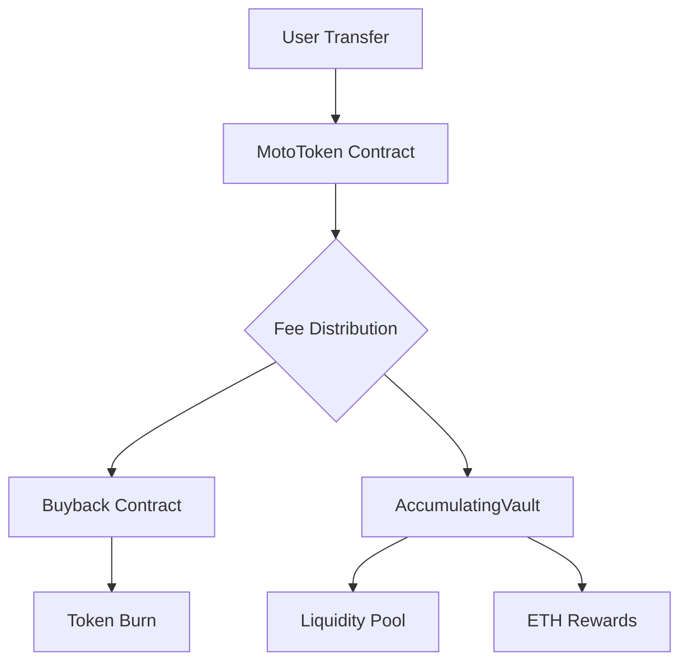

# 🏍️ Moto Token ($MOTO)

<div style="text-align: center;">
  
  <h1>Moto Token ($MOTO)</h1>
</div>


> **Moto Token (MOTO)** is an ERC-20 cryptocurrency with advanced tokenomics, integrating transaction fees, buyback-and-burn mechanics, liquidity provisioning, and ETH reflection rewards.

---

## ✨ Key Features

- ✅ **Advanced Tokenomics**: 5% transaction fee with automatic redistribution
- 🔥 **Deflationary Mechanism**: Buyback and burn reduces supply over time
- 💰 **ETH Reflection Rewards**: Automatic distribution to holders
- ⚡ **BaseSwap DEX Integration**: Seamless trading on Base network
- 🔒 **Security First**: Reentrancy protection and emergency recovery
- 🛠 **Modular Architecture**: Separate contracts for different functionalities

---

## 📊 Tokenomics

| Parameter | Value |
|-----------|-------|
| **Symbol** | MOTO |
| **Total Supply** | 1,000,000,000 |
| **Decimals** | 18 |
| **Network** | Base |
| **Fee Structure** | 5% total |
| **Buyback Rate** | 2% |
| **Liquidity Rate** | 3% |

---

## 🏗️ Architecture Overview



### Core Contracts

- **MotoToken**: Main ERC-20 contract with fee mechanism
- **Buyback**: Automated token buyback and burning
- **AccumulatingVault**: Liquidity management and reflection rewards
- **LiquidityLocker**: LP token locking for investor protection

---

## 🚀 Quick Start

### Prerequisites

- Node.js v18+
- npm or yarn
- MetaMask wallet
- Base network configured

### Installation

```bash
# Clone the repository
git clone <repository-url>
cd moto-token

# Install dependencies
npm install

# Copy environment template
cp .env.example .env
# Edit .env with your private key and API keys
```

### Development

```bash
# Compile contracts
npx hardhat compile

# Run tests
npx hardhat test

# Start local node
npx hardhat node

# Deploy to testnet
npx hardhat run scripts/deploy.js --network base-sepolia
```

---

## 📋 Usage

### CLI Deployment

```bash
# Deploy all contracts
npx hardhat run scripts/deploy.js --network base-sepolia

# Verify contracts on Etherscan
npx hardhat run scripts/verify.js --network base-sepolia deployments/base-sepolia-*.json
```

### Smart Contract Interaction

```javascript
// Transfer tokens (fees applied automatically)
await motoToken.transfer(recipient, amount);

// Check fee calculation
const [fee, netAmount] = await motoToken.calculateFee(amount);

// Claim reflection rewards
await vault.claimRewards();
```

---

## 🔧 Configuration

### Environment Variables

```env
PRIVATE_KEY=your_private_key_without_0x
BASESCAN_API_KEY=your_basescan_api_key
INITIAL_LIQUIDITY_ETH=1.0
INITIAL_LIQUIDITY_TOKENS_PERCENT=80
```

### Network Configuration

The project supports multiple networks through Hardhat configuration:
- **Local**: Hardhat network for development
- **Testnet**: Base Sepolia for testing
- **Mainnet**: Base for production

---

## 🛡️ Security

### Best Practices

- **Private Keys**: Never commit private keys to version control
- **Access Control**: Only owner can modify critical parameters
- **Emergency Functions**: Owner can recover stuck assets
- **Slippage Protection**: Configurable tolerance for DEX operations
- **Reentrancy Guards**: Protection against reentrancy attacks

### Security Audit

> ⚠️ **This contract has not been audited.** Use at your own risk in production environments.

---

## 🤝 Contributing

We welcome contributions! Please follow these steps:

1. Fork the repository
2. Create a feature branch (`git checkout -b feature/amazing-feature`)
3. Commit your changes (`git commit -m 'Add amazing feature'`)
4. Push to the branch (`git push origin feature/amazing-feature`)
5. Open a Pull Request

### Development Guidelines

- Follow Solidity style guide
- Write comprehensive tests for new features
- Update documentation for API changes
- Ensure all tests pass before submitting PR

---

## 📚 Documentation

- [Smart Contract Architecture](./docs/ARCHITECTURE.md)
- [API Reference](./docs/API.md)
- [Deployment Guide](./docs/DEPLOYMENT.md)
- [Security Considerations](./docs/SECURITY.md)

---

## 🌐 Community

- **Website**: [https://matmotofix.pro](https://matmotofix.pro)
- **Twitter**: [@MatMotoFix_Pro](https://twitter.com/MatMotoFix_Pro)
- **Discord**: [Join our community](https://discord.gg/MatMotoFix.Pro)
- **Email**: support@matmotofix.pro

---

## 📄 License

This project is licensed under the MIT License - see the [LICENSE](LICENSE) file for details.

---

## ⚠️ Disclaimer

This software is provided "as is" without warranty of any kind. Use at your own risk. The developers are not responsible for any financial losses incurred through the use of this software.
